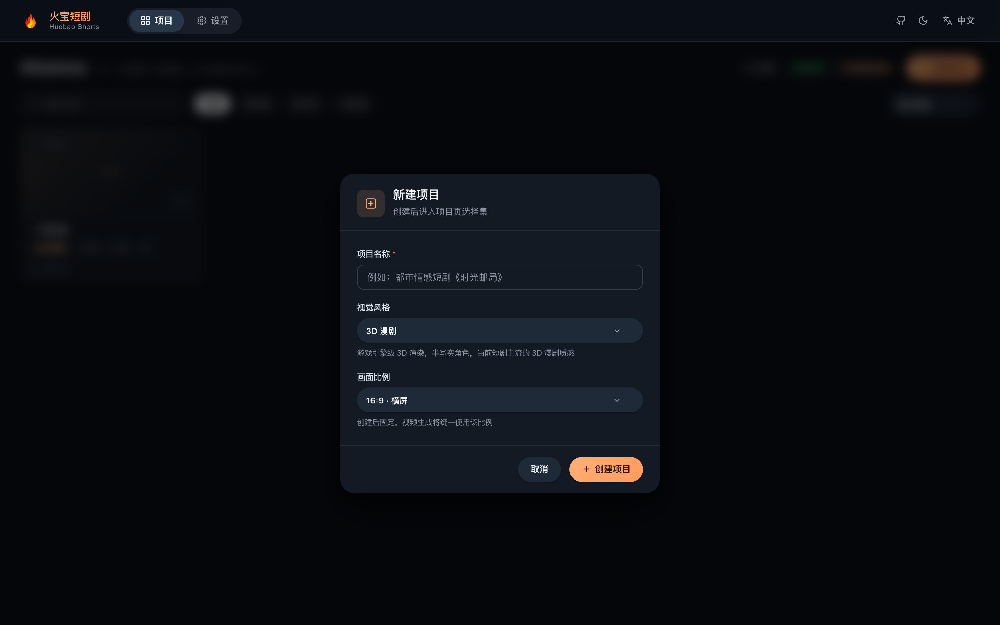
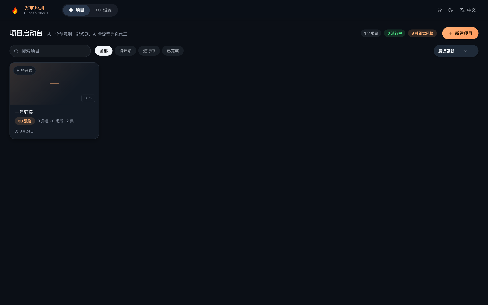
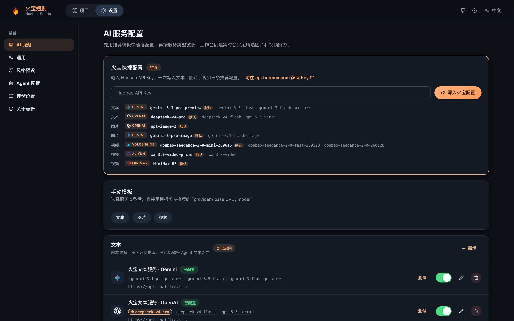
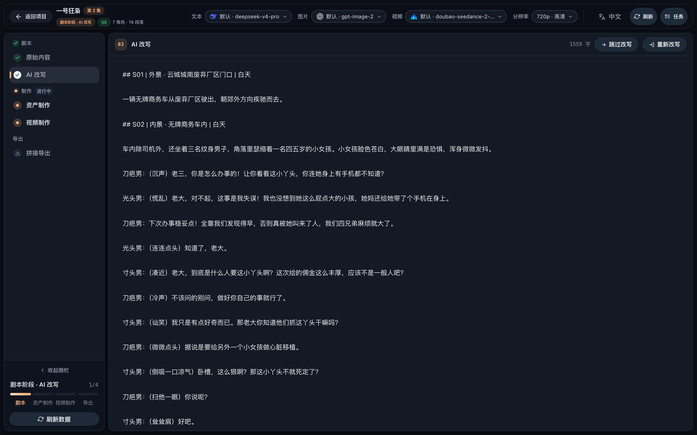
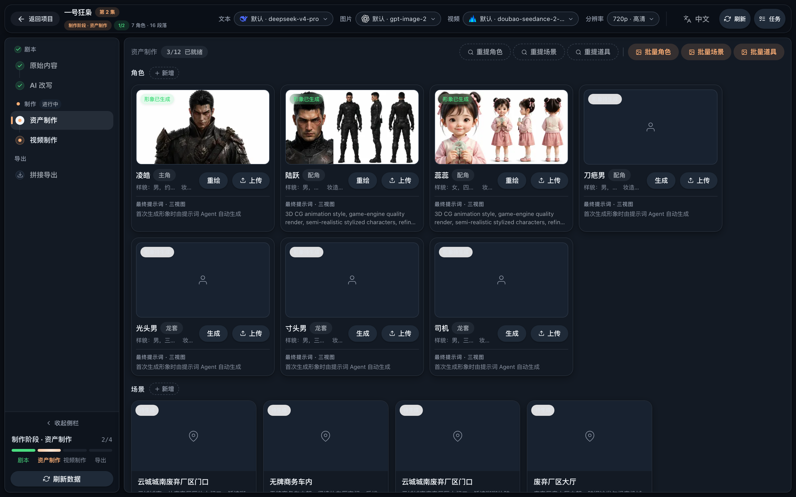
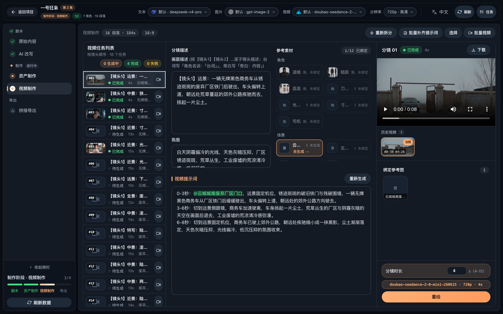
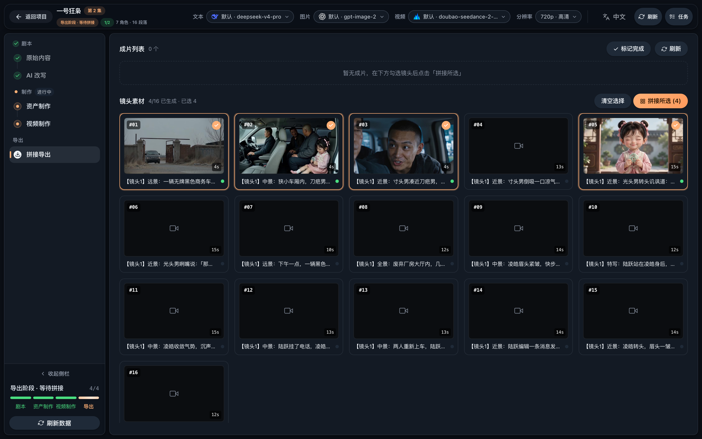
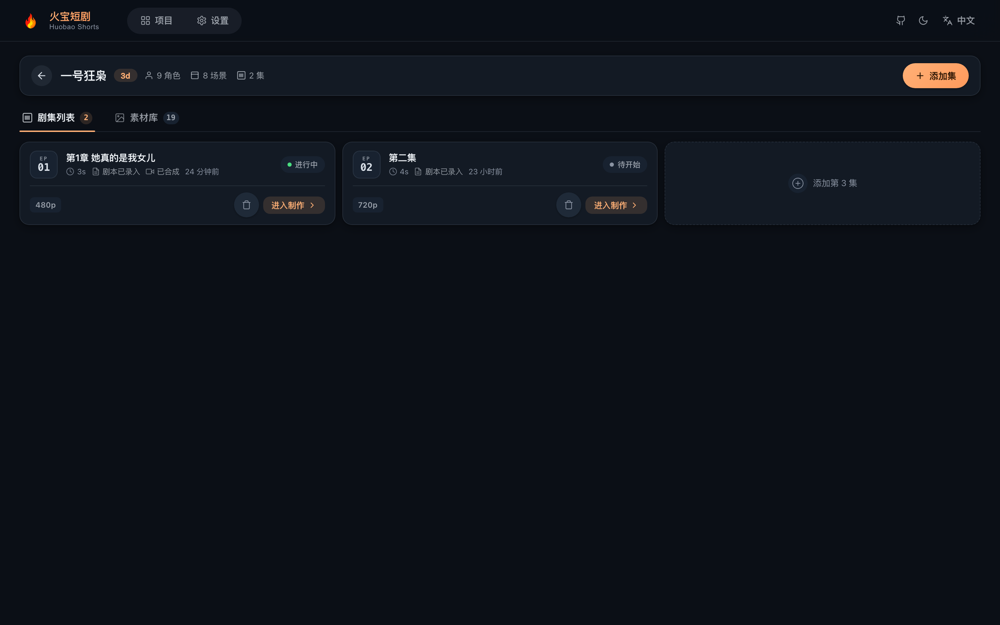

# 🎬 Huobao Drama - AI 숏드라마 생성 플랫폼

<div align="center">

**TypeScript 풀스택 기반 AI 숏드라마 자동 제작 플랫폼**

[](https://nodejs.org)
[](https://vuejs.org)
[](https://creativecommons.org/licenses/by-nc-sa/4.0/)
[](https://github.com/chatfire-AI/huobao-drama/releases/latest)

[English](README.md) | [简体中文](README.zh-CN.md) | [日本語](README.ja.md) | **한국어**

[기능](#-기능) • [빠른 시작](#-빠른-시작) • [튜토리얼](#-그림-튜토리얼) • [데스크톱 앱](#-데스크톱-앱-권장) • [배포](#-배포)

<h2>🔑 <a href="https://api.firemux.com">Huobao API Key 받기 👉 바로 보기</a></h2>

**텍스트 · 이미지 · 영상 모든 AI 기능, Key 하나로 활성화**

배포 후 「설정 → 火宝快捷 설정」에 Key 를 붙여넣으면 추천 설정 3개가 한 번에 입력됩니다

<h3>📥 <a href="https://github.com/chatfire-AI/huobao-drama/releases/latest">데스크톱 앱 다운로드 (macOS / Windows)</a></h3>
<h3>🌐 <a href="https://www.chatfire.site">공식 웹사이트</a></h3>

</div>

---

## 📖 프로젝트 소개

Huobao Drama는 AI 기반 숏드라마 자동 제작 플랫폼으로, 각본 생성, 캐릭터 디자인, 스토리보드 제작부터 영상 합성까지 전 과정을 자동화합니다.

### 🎯 핵심 가치

- **🤖 AI 기반**：대규모 언어 모델로 각본을 분석하여 캐릭터, 장면, 스토리보드 정보를 추출
- **🎨 지능형 창작**：AI 이미지 생성으로 캐릭터 이미지와 장면 배경 제작
- **📹 영상 생성**：텍스트→영상 및 이미지→영상 모델로 스토리보드 영상 자동 생성
- **🔄 워크플로**：아이디어부터 완성 영상까지 숏드라마 제작 전 과정을 한 곳에서 완료

### 🛠️ 기술 아키텍처

```
frontend/   — Nuxt 3 + Vue 3 + TypeScript (순수 CSS, UI 프레임워크 없음)
backend/    — Hono + Drizzle ORM + Mastra AI Agents + better-sqlite3
backend/workspace/skills/ — Agent 스킬 정의 (SKILL.md, UI에서 온라인 편집 가능)
desktop/    — Electron 데스크톱 버전 (메인 프로세스 + esbuild 번들 + electron-builder로 dmg/exe 생성)
data/       — 생성된 에셋과 SQLite 데이터베이스
```

---

## ✨ 기능

### 🎭 캐릭터 관리

- ✅ AI 캐릭터 이미지 생성
- ✅ 캐릭터 일괄 생성
- ✅ 캐릭터 이미지 업로드 및 관리

### 🎬 영상 작업

- ✅ AI 영상 작업 자동 생성
- ✅ 장면 설명 및 영상 프롬프트 생성
- ✅ 작업별 영상 일괄 생성

### 🎥 영상 생성

- ✅ 텍스트→영상 자동 생성
- ✅ FFmpeg 샷 단위 합성 및 자막 처리
- ✅ 에피소드 전체 병합 및 납출

### 📦 에셋 관리

- ✅ 소재 라이브러리 통합 관리
- ✅ 로컬 스토리지 지원
- ✅ 작업 진행 상황 추적

### 🤖 AI Agents

4개의 Mastra Agent 내장, 데이터베이스 설정과 Skill 확장 지원:

| Agent | 역할 |
|---|---|
| `script_rewriter` | 소설 → 형식화된 각본 리라이팅 |
| `extractor` | 캐릭터 / 장면 / 소품 지능형 추출 및 중복 제거 |
| `storyboard_breaker` | 각본 → 스토리보드 시퀀스 분해 |
| `prompt_generator` | 캐릭터/장면/소품 이미지 프롬프트 + 스토리보드 영상 프롬프트 생성 |

### 🌐 다국어 UI

인터페이스는 **中文 / English / 日本語 / 한국어** 4개 언어를 내장하고, AI 생성 콘텐츠의 언어를 전역으로 설정할 수 있습니다.

### 🔌 멀티 프로바이더 지원

| 유형 | 지원 프로바이더 |
|---|---|
| **텍스트** | OpenAI(호환 API), Gemini |
| **이미지** | OpenAI, Gemini, Volcano Engine |
| **영상** | Volcano Engine Seedance 2.0(Standard / Fast / Mini), MiniMax H3, Alibaba Bailian Wan 3.0(Prime / Standard) |

---

## 🚀 빠른 시작

### 📋 환경 요구 사항

| 소프트웨어 | 버전 | 설명 |
|---|---|---|
| **Node.js** | 20+ | 프런트엔드/백엔드 실행 환경 |
| **npm** | 9+ | 패키지 관리 도구 |

> **데이터베이스 설치 불필요**：SQLite 내장(프로젝트 데이터 디렉터리의 단일 파일)으로 데이터베이스 서버 설치가 필요 없습니다.
> **FFmpeg 설치 불필요**：`ffmpeg-static` / `ffprobe-static` npm 패키지에 바이너리가 내장되어 바로 사용할 수 있습니다.

### ⚙️ 환경 변수

설정 파일 없이 환경 변수로 설정합니다(모두 기본값이 있어 로컬 개발은 무설정으로 시작 가능):

| 변수 | 기본값 | 설명 |
|---|---|---|
| `SQLITE_PATH` | `<저장소>/data/huobao.sqlite3` | SQLite 데이터베이스 파일 위치 |
| `PORT` | `5679` | 백엔드 서비스 포트 |
| `STORAGE_PATH` | `<저장소>/data/static` | 생성 파일 저장 디렉터리 |
| `HUOBAO_DATA_DIR` | — | 데스크톱 버전에서 Electron 메인 프로세스가 주입(userData 데이터 루트) |
| `WORKSPACE_PATH` | `backend/workspace` | Agent 스킬/프롬프트 디렉터리(데스크톱 버전은 userData의 쓰기 가능한 복사본) |
| `FRONTEND_DIST` | `frontend/dist` | 프런트엔드 정적 빌드 디렉터리 |
| `FFMPEG_BIN` / `FFPROBE_BIN` | npm 내장 바이너리 | 사용자 지정 ffmpeg/ffprobe 실행 파일 경로 |
| `PUBLIC_BASE_URL` | — | Seedance가 로컬 참조 리소스를 사용할 때 필요한 공개 주소(서버 배포용) |

> **설명**：AI 서비스의 API Key, Base URL, 모델 파라미터는 모두 웹 UI의 「설정」 페이지에서 설정하여 데이터베이스에 저장합니다. 설정 파일이나 환경 변수로 관리하지 않습니다.

### 📥 설치

```bash
# 저장소 클론
git clone https://github.com/chatfire-AI/huobao-drama.git
cd huobao-drama

# 백엔드 의존성 설치
cd backend && npm install

# 프런트엔드 의존성 설치
cd ../frontend && npm install
```

### 🎯 실행

#### 방법 1: 개발 모드(권장)

프런트엔드와 백엔드를 분리하여 핫 리로드 지원:

```bash
# 터미널 1: 백엔드
cd backend
npm run dev

# 터미널 2: 프런트엔드
cd frontend
npm run dev
```

- 프런트엔드 주소: `http://localhost:3013`
- 백엔드 API: `http://localhost:5679/api/v1`
- 프런트엔드가 `/api`와 `/static`을 백엔드로 자동 프록시

#### 방법 2: 단일 서비스 모드

백엔드가 API와 프런트엔드 정적 파일을 모두 제공:

```bash
# 1. 프런트엔드 빌드
cd frontend && npm run generate

# 2. 빌드 산출물을 백엔드가 읽는 디렉터리로 복사
#    (generate 산출물은 .output/public, 백엔드는 frontend/dist를 읽음)
cp -r .output/public dist

# 3. 백엔드 시작
cd ../backend && npm start
```

접속: `http://localhost:5679`

### 🗄️ 데이터베이스

SQLite 내장(`better-sqlite3` + WAL 모드). 최초 시작 시 테이블 자동 생성(멱등 DDL 재생 + 시드 데이터). 기본 파일은 `data/huobao.sqlite3`이며 `SQLITE_PATH`로 변경 가능. 데스크톱 버전의 데이터는 사용자 데이터 디렉터리(`~/Library/Application Support/HuobaoDrama/data/`)에 저장됩니다.

구버전 MySQL에서 데이터 마이그레이션:

**시작 시 자동 마이그레이션(권장)**: MySQL이 명시적으로 설정되어 있고(`DATABASE_URL` 또는 `MYSQL_HOST`) SQLite가 비어 있으면, 백엔드 시작 시 자동으로 감지하여 모든 테이블을 한 번만 가져옵니다(테이블별 행 수 검증, 단일 트랜잭션 원자적 쓰기, 실패 시 자동 롤백 후 다음 시작 때 재시도, 성공 시 `.mysql-imported` 마커를 기록하여 중복 방지). `MYSQL_AUTO_IMPORT=false`로 비활성화할 수 있습니다.

```bash
# 수동 실행도 가능(대상 DB가 비어 있지 않으면 --force 필요, 쓰기 전 자동 백업)
cd backend && npx tsx scripts/import-mysql-to-sqlite.ts
```

> 마이그레이션은 데이터베이스 행만 포함합니다. 구 배포의 `data/static/` 아래 이미지/영상 등 미디어 파일은 수동으로 복사해야 하며, 그렇지 않으면 기존 소재에 접근할 수 없습니다.

### 🔑 첫 사용: AI 서비스 설정

시작 후 모든 AI 기능(텍스트/이미지/영상)을 사용하려면 먼저 모델 서비스를 설정해야 합니다. 미설정 시 페이지 상단에 배너로 안내합니다:

1. 「설정」 페이지 열기
2. 「火宝快捷 설정」에 Huobao API Key 붙여넣기([api.firemux.com에서 발급](https://api.firemux.com)). 텍스트, 이미지, 영상 추천 설정 3개가 한 번에 입력됩니다
3. 또는 「수동 템플릿」으로 프로바이더별 추가. 연결 테스트 지원

설정이 완료되면 배너가 자동으로 사라지고 에피소드 제작을 시작할 수 있습니다.

---

## 📖 그림 튜토리얼

소설부터 완성 에피소드까지의 전체 제작 흐름입니다. 왼쪽 진행 표시줄이 항상 현재 단계를 보여줍니다.

### 1단계 · 프로젝트 생성

홈에서 "새 프로젝트"를 클릭하고 **화면 비율**(16:9 가로 / 9:16 세로, 생성 후 변경 불가)과 **화풍**(3D / 실사 등, 모든 이미지 프롬프트에 주입)을 선택합니다.

<p align="center">
  
</p>

<p align="center">
  
</p>

### 2단계 · AI 서비스 설정 (최초)

설정 페이지의 "휘바오 빠른 설정"에 API 키를 붙여넣으면 추천 설정 3종을 한 번에 등록합니다. 수동 템플릿으로 직접 추가할 수도 있습니다. 사용 모델은 상단 바에서 언제든 전환 가능합니다(5단계 참고).

<p align="center">
  
</p>

### 3단계 · 대본 단계

제작 화면에 **원문(소설)**을 붙여넣고 "AI 재작성"을 실행하면 촬영용 대본이 생성됩니다 — 에피소드별 분할 및 장면·캐릭터 주석 포함. 모델과 톤을 바꿔가며 재작성할 수 있습니다.

<p align="center">
  
</p>

### 4단계 · 에셋 제작

대본에 **추출**을 실행하면 캐릭터 / 장면 / 소품 목록이 자동 생성됩니다. 각 항목의 "이미지 생성"으로 일관성 있는 참조 이미지를 만들 수 있습니다(일괄 생성 지원). 이 이미지들은 영상 생성 시 참조 소재로 주입됩니다.

<p align="center">
  
</p>

### 5단계 · 스토리보드와 영상

"영상 제작" 페이지에서 먼저 **스토리보드 분할**을 실행하세요(AI가 컷을 나누고 영상 프롬프트 생성). 그 후:

- 상단 바에서 **영상 모델** 선택(Seedance / Wan 3.0 / MiniMax 등). 해상도와 길이 옵션은 모델에 연동됩니다
- 오른쪽에서 각 컷의 프롬프트를 확인·조정(`@캐릭터명` 참조는 자동으로 참조 이미지에 매핑)
- "일괄 영상 생성"으로 작업 시작. 실패한 작업은 원클릭 재시도

<p align="center">
  
</p>

<p align="center">
  
</p>

### 6단계 · 병합과 내보내기

컷을 선택(호버로 각 클립 미리보기)하고 "병합 시작"을 누르면 FFmpeg이 완성 에피소드를 자동 합성합니다. 온라인 재생·다운로드 가능. 완료 후 "완료 표시"를 누르면 진행 표시줄이 켜집니다.

<p align="center">
  
</p>

에피소드 목록에서 각 화의 제작 현황을 확인하고 "제작 열기"로 이어서 작업할 수 있습니다:

<p align="center">
  
</p>

---

## 📦 배포

### 🖥️ 데스크톱 앱(권장)

**⬇️ 빌드된 설치 파일: [GitHub Releases](https://github.com/chatfire-AI/huobao-drama/releases/latest) · [중국용 미러(Tencent COS)](https://installer.chatfire.site/huobao-drama/v4.0.4/)**

| 플랫폼 | 다운로드 파일 |
|---|---|
| macOS(Apple Silicon, M 시리즈) | `HuobaoDrama-4.0.4-arm64.dmg` |
| macOS(Intel) | `HuobaoDrama-4.0.4.dmg` |
| Windows | `HuobaoDrama.Setup.4.0.4.exe` |

> 중국 본토에서는 GitHub이 불안정하므로 Tencent COS 미러를 이용하세요. 앱 내 업데이터도 COS를 우선하고 GitHub으로 폴백합니다.

**커맨드라인 설치(권장, 복구 불필요)**: curl로 다운로드하면 macOS 격리 속성이 붙지 않아 "손상됨" 경고 없이 바로 실행됩니다(Apple Silicon은 `-arm64.dmg`, Intel은 일반 dmg 사용):

```bash
curl -L -o /tmp/HuobaoDrama.dmg https://installer.chatfire.site/huobao-drama/v4.0.4/HuobaoDrama-4.0.4-arm64.dmg \
  && hdiutil attach -nobrowse /tmp/HuobaoDrama.dmg \
  && cp -R /Volumes/HuobaoDrama*/HuobaoDrama.app /Applications/ \
  && hdiutil detach /Volumes/HuobaoDrama*
```

빌드 불필요 — dmg/exe를 다운로드해 바로 설치하면 됩니다. 설치된 클라이언트는 내장 업데이터로 자동 업데이트됩니다. (소스에서 직접 패키징하려면 아래 명령을 참조하세요.)

더블클릭 설치로 바로 사용할 수 있는 데스크톱 버전(macOS + Windows). 데이터베이스(SQLite), 생성된 미디어 파일, Agent 스킬은 모두 사용자 데이터 디렉터리에 저장되며 앱을 삭제필필도 데이터에 영향이 없습니다.

```bash
# 원커맨드 패키징(프런트엔드 generate → 백엔드 esbuild → electron-builder)
npm run dist        # macOS dmg(arm64 + Intel)
npm run dist:win    # Windows NSIS 설치 프로그램(win-x64, macOS에서 크로스 빌드 가능)

# 산출물
# desktop/release/HuobaoDrama-<버전>-arm64.dmg        (Apple Silicon)
# desktop/release/HuobaoDrama-<버전>.dmg              (Intel)
# desktop/release/HuobaoDrama Setup <버전>.exe        (Windows)
```

설치 안내:

- macOS 미서명 패키지는 첫 실행 시 "App이 손상되어 열 수 없습니다"라는 메시지가 뜰 수 있습니다(Apple Silicon에서 흔함). 이는 Gatekeeper 격리 속성 때문이며 파일이 실제로 손상된 것은 아닙니다. 복구 방법은 두 가지입니다:
  1. **dmg에 복구 스크립트 포함**: 앱을 "응용 프로그램"으로 드래그한 후 dmg 창 하단의 "如提示已损坏请双击我.command"를 더블클릭하면 자동으로 복구됩니다;
  2. 또는 터미널에서 `sudo xattr -cr /Applications/HuobaoDrama.app` 실행.

  복구는 처음 한 번만 필요하며, 이후에는 정상 실행되고 앱 내 자동 업데이트에도 영향이 없습니다.
- Windows 미서명 패키지는 SmartScreen에서 「추가 정보 → 실행」 선택
- 사용자 데이터 디렉터리: `~/Library/Application Support/HuobaoDrama/`(데이터베이스, 생성된 미디어, 온라인 편집한 스킬 복사본)
- FFmpeg/FFprobe 바이너리 내장, 시스템 설치 불필요
- Electron은 37.x로 고정: better-sqlite3의 win32 프리빌드가 해당 ABI까지만 지원(크로스 패키징 시 컴파일 불필요의 핵심)
- 앱 내 외부 링크(「api.firemux.com에서 Key 받기」 등)는 시스템 브라우저로 바로 열립니다

#### 🔄 앱 내 업데이트(Apple 서명 불필요)

데스크톱 버전에는 업데이터가 내장되어 있습니다(Tauri와 동류 방식: macOS 디렉터리 교체 / Windows 사일런트 설치, 로컬 sha256 검증). 새 버전 릴리스 절차:

```bash
# 1. desktop/package.json의 version을 수정한 후 패키징
npm run dist        # macOS(dmg + 업데이트용 zip 산출)
npm run dist:win    # Windows(Setup.exe 산출)

# 2. 버전 매니페스트 release/latest.json 생성(플랫폼별 sha256 포함)
cd desktop && npm run feed

# 3. 릴리스: latest.json + 설치 패키지 + zip을 GitHub Release에 업로드(태그는 v1.0.1 형식)
```

설치된 클라이언트는 시작 후 매니페스트를 자동으로 확인하고(「설정 → 정보 및 업데이트」에서 수동 확인도 가능), 새 버전을 발견하면 다운로드 및 설치를 안내합니다. 매니페스트 주소는 `HUOBAO_UPDATE_FEED` 환경 변수로 변경할 수 있습니다.

데스크톱 버전 개발 디버깅:

```bash
npm run build:frontend   # 프런트엔드 정적 산출물(frontend/.output/public)
cd desktop && npm run dev  # 백엔드 번들 후 Electron 창으로 실행
```

> 알려진 제한: Seedance 영상 모델이 로컬 참조 리소스를 사용하려면 `PUBLIC_BASE_URL` 공개 주소가 필요합니다. 데스크톱 버전에는 공개 진입점이 없어 해당 시나리오에서는 명확한 오류 메시지가 표시됩니다. 텍스트→영상/이미지 생성 등 나머지 기능에는 영향이 없습니다.

---

### 🏭 서버 배포

```bash
# 1. 프런트엔드 빌드
cd frontend && npm run generate

# 2. 빌드 산출물 복사(generate 산출물은 frontend/.output/public, 백엔드는
#    frontend/dist를 읽음. 이 단계를 생략하면 API는 정상이지만 페이지가 404)
cp -r .output/public dist && cd ..

# 3. 백엔드 시작
cd backend && npm start
```

서버에 업로드할 파일:

```
backend/                    # 백엔드 소스 + node_modules
backend/workspace/skills/   # Agent 스킬 파일
frontend/dist/              # 프런트엔드 빌드 산출물
data/                       # 데이터 디렉터리(최초 실행 시 자동 생성)
```

#### Nginx 리버스 프록시

```nginx
server {
    listen 80;
    server_name your-domain.com;

    # 참조 영상/오디오 업로드 최대 50MB
    client_max_body_size 100m;

    # 생성된 이미지/영상은 디스크에서 직접 서빙(Node를 거치지 않음):
    # sendfile 제로 카피 + 장기 캐시
    # (파일은 uuid 명명, 내용 불변이므로 immutable 캐시 안전)
    location /static/ {
        alias /path/to/huobao-drama/data/static/;
        sendfile on;
        tcp_nopush on;
        expires 1y;
        add_header Cache-Control "public, immutable";
    }

    location / {
        proxy_pass http://localhost:5679;
        proxy_set_header Host $host;
        proxy_set_header X-Real-IP $remote_addr;
        proxy_set_header X-Forwarded-For $proxy_add_x_forwarded_for;
    }
}
```

> 미디어 로딩 최적화: 이미지 생성 시 백엔드가 목록 페이지용 400px 썸네일(`*_thumb.webp`)을 자동 생성하고, 영상은 포스터 프레임(`*_poster.jpg`)을 커버로 추출합니다. 프런트엔드는 큰 이미지를 열거나 재생할 때만 원본 파일을 로드합니다. 기존 파일은 `backend/`에서 `npm run backfill-artwork`를 실행해 일괄 보완할 수 있습니다.

### 🐳 Docker 배포(앱 내 업데이트 포함)

**방법 A — 사전 빌드 이미지(클론·빌드 불필요)**: 멀티 아키텍처(`linux/amd64` + `linux/arm64`), x86 서버와 ARM 디바이스 자동 매칭

```bash
docker pull huobao/huobao-drama:4.0.0

docker run -d \
  --name huobao-drama \
  -p 5679:5679 \
  -v huobao-data:/app/data \
  --restart unless-stopped \
  huobao/huobao-drama:4.0.0
```

**방법 B — docker compose(소스 빌드 + Watchtower 인앱 업데이트)**: 저장소 루트에 올인원 `Dockerfile`(프런트엔드 generate + 백엔드 의존성/런타임 3단계, 백엔드는 서버 배포와 동일하게 tsx로 실행)과 `docker-compose.yml`(앱 + Watchtower)을 제공합니다:

```bash
# 1. 환경 설정(Watchtower 토큰, app과 watchtower 양쪽이 일치해야 함)
cp .env.example .env   # WATCHTOWER_TOKEN 수정

# 2. 빌드 및 시작(릴리스 시 버전을 주입하여 「정보 및 업데이트」 비교에 사용)
HUOBAO_VERSION=4.0.0 docker compose up -d --build

# 3. http://localhost:5679 접속
```

- **데이터 영속화**: 네임드 볼륨 `huobao-data`를 `/app/data`에 마운트(SQLite + 생성된 이미지/영상 + workspace/skills). 이미지 업데이트 시에도 데이터 유지
- **앱 내 업데이트**: compose에 [Watchtower](https://containrrr.dev/watchtower/) 사이드카 포함(`--label-enable`로 라벨이 지정된 컨테이너만 업데이트, `--cleanup`으로 구 이미지 정리, 매일 자체 점검). 「설정 → 정보 및 업데이트」에서 새 버전 확인 및 「지금 업데이트」 가능 — 백엔드가 Watchtower HTTP API를 통해 트리거하여 새 이미지를 가져와 컨테이너를 재생성합니다. 몇 분 후 페이지를 새로고침하면 완료
- **수동 모드**: `docker-compose.yml`에서 app의 `HUOBAO_WATCHTOWER_*` 환경 변수 2개(또는 watchtower 서비스 전체)를 삭제하면 「정보 및 업데이트」는 새 버전 알림 + 수동 명령 `docker compose pull && docker compose up -d`으로 전환됩니다
- **이미지 릴리스**: `docker buildx build --platform linux/amd64,linux/arm64 --build-arg HUOBAO_VERSION=x.y.z -t huobao/huobao-drama:x.y.z -t huobao/huobao-drama:latest --push .`. 버전 매니페스트는 데스크톱 버전과 GitHub Releases의 `latest.json`을 공유(`HUOBAO_UPDATE_FEED`로 재정의 가능)

---

## 🎨 기술 스택

### 백엔드

- **런타임**: Node.js 20+
- **웹 프레임워크**: Hono
- **ORM**: Drizzle ORM + better-sqlite3(WAL 모드)
- **AI Agent**: Mastra + AI SDK(OpenAI 호환)
- **영상 처리**: FFmpeg(fluent-ffmpeg + 내장 바이너리)
- **이미지 처리**: Sharp

### 데스크톱

- **셸**: Electron(utilityProcess가 백엔드를 호스팅, BrowserWindow는 동일 출처로 로드)
- **패키징**: esbuild(백엔드 단일 파일 번들) + electron-builder(dmg arm64/x64, NSIS win-x64)

### 프런트엔드

- **프레임워크**: Nuxt 3(SPA 모드)
- **언어**: Vue 3 + TypeScript
- **라우팅**: 파일 라우팅(Vue Router 4)
- **스타일**: 순수 CSS + CSS Variables
- **아이콘**: Lucide Vue
- **i18n**: vue-i18n(中文 / English / 日本語 / 한국어)

---

## 📝 자주 묻는 질문

### Q: 데스크톱 버전의 데이터는 어디에 저장되나요?

A: `~/Library/Application Support/HuobaoDrama/data/`(SQLite 데이터베이스 + 생성된 이미지/영상)에 저장되며, 온라인 편집한 스킬의 복사본은 같은 수준의 `workspace/` 디렉터리에 있습니다. 개발 모드에서는 저장소의 `data/` 디렉터리를 사용합니다.

### Q: 구버전 MySQL 데이터를 SQLite로 마이그레이션하려면?

A: MySQL에 연결 가능한 상태(환경 변수 또는 `backend/.env`)를 유지하고 `cd backend && npx tsx scripts/import-mysql-to-sqlite.ts`를 실행하세요. 스크립트가 자동으로 테이블을 생성하고 테이블별로 가져오며 행 수를 검증합니다(대상 DB가 비어 있지 않으면 `--force` 필요, 쓰기 전 자동 백업).

### Q: FFmpeg가 설치되지 않았거나 찾을 수 없다고 나옵니다?

A: 설치할 필요가 없습니다. 프로젝트에 `ffmpeg-static` / `ffprobe-static` 바이너리가 내장되어 있습니다(데스크톱 버전에도 포함). 시스템 `PATH`의 FFmpeg와 충돌하지 않으며, `FFMPEG_BIN`/`FFPROBE_BIN`으로 명시적으로 지정할 수도 있습니다.

### Q: 페이지 상단에 「모델 미설정」이 표시됩니다?

A: 정상적인 첫 배포 안내입니다. 「설정」 페이지에서 「火宝快捷 설정」에 API Key를 붙여넣어 한 번에 입력하거나, 「수동 템플릿」으로 프로바이더를 추가하세요. 텍스트, 이미지, 영상 3가지 모두에 활성화된 설정이 있으면 배너가 자동으로 사라집니다.

### Q: 프런트엔드가 백엔드 API에 연결되지 않습니다?

A: 백엔드가 시작되었는지, 포트가 올바른지 확인하세요. 개발 모드의 프록시 설정은 `frontend/nuxt.config.ts`에 있습니다.

### Q: 데이터베이스 테이블이 생성되지 않았습니다?

A: 백엔드는 최초 시작 시 모든 테이블을 자동으로 생성합니다. 로그에서 초기화 성공 여부를 확인하세요.

---

## 📋 업데이트 로그

### v4.0.0 (2026-08)

#### 🖥️ 데스크톱 앱 + 데이터베이스 마이그레이션

- Electron 데스크톱 버전(macOS dmg, arm64/x64 듀얼 아키텍처)
  - 더블클릭 설치, 즉시 사용: 자동 포트 선택, 단일 인스턴스 잠금, 충돌 분리된 백엔드 서브프로세스
  - 사용자 데이터 분리: SQLite DB / 생성된 미디어 / 스킬 복사본 모두 userData 디렉터리에 저장
  - FFmpeg/FFprobe 포함 배포. workspace 스킬 템플릿은 첫 시작 시 복사, 업그레이드 시 누락분만 보충하고 덮어쓰지 않음
- 데이터베이스를 MySQL에서 SQLite로 완전 마이그레이션(better-sqlite3 + WAL)
  - 비즈니스 코드 변경 제로(Drizzle 쿼리 계층은 본질적으로 이식 가능), 멱등 DDL 재생
  - 1회용 가져오기 스크립트 `import-mysql-to-sqlite.ts` 추가(테이블별 행 수 검증 + 자동 백업)
- 백엔드 esbuild 단일 파일 번들(externals: sharp/better-sqlite3/ffmpeg 바이너리 패키지)
- Docker/MySQL 배포 방식 제거(git 히스토리에서 복구 가능)

### v3.1.0 (2026-09)

- Alibaba Bailian Wan 3.0 동영상 모델 추가(Prime / 표준, 공식 input.media/parameters 파라미터 지원)
- 작업대 상단 바에 해상도 선택기 추가, 제공사별 네이티브 단계 표시(Seedance 480p/720p, MiniMax 768P/2K, Wan 480P/720P/1080P)
- 기본 동영상 모델을 Seedance 2.0 Mini로 변경
- 동영상 모델 전환 시 제공사/모델 불일치로 인한 생성 오류 수정
- 배치 동영상: 선택 모드 + 생성 전 확인(숏 수/총 길이/모델/해상도), 실패 작업 원클릭 재시도
- 스토리보드 길이를 동영상 생성 파라미터 영역에서 직접 편집·저장, 단건/배치 생성에 통일 적용
- 실사/민감 콘텐츠 심사 실패 시 모델 전환 후 재시도 안내

### v3.0.0 (2026-08)


#### 🚀 배포 및 경험 최적화

- Docker 배포 준비 개선
  - MySQL / 앱 헬스 체크, 데이터베이스 준비 후 앱 시작
  - 데이터베이스 초기화에 재시도 추가, 컨테이너 오케스트레이션에서 첫 배포 무인 완료
  - 시스템 FFmpeg 의존 제거, 내장 바이너리로 전면 전환
  - Agent skills 디렉터리 볼륨 영속화(설정 페이지 온라인 편집 유실 방지)
  - `docker/init.sql` 및 납출 스크립트 추가(DBA 검토 / 사전 테이블 생성)
- 첫 사용 가이드
  - AI 서비스 미설정 시 사이트 상단 배너로 설정 페이지 안내
  - 설정 페이지에 「火宝快捷 설정」 추가: Key 하나로 텍스트/이미지/영상 추천 설정 3개 입력
  - 모델 미설정 오류의 중국어화 및 설정 페이지 안내
- 영상 모델 기본값을 Seedance 2.0 Fast로 조정
- 프로바이더 통합: OpenAI / Gemini / Volcano Engine만 유지
- 워크벤치: 작업 목록 드로어, 파이프라인 대섹션 상태, 선택적 병합(병합 전 영상 파일 존재 검증)
- 소재 라이브러리 개편, @멘션 최적화, 에피소드 목록 재구성

### v2.0.0 (2026-04)

#### 🚀 대규모 업데이트

- 프로젝트를 TypeScript 기술 스택으로 전면 마이그레이션
  - 백엔드: Hono + Drizzle ORM + mysql2
  - 프런트엔드: Nuxt 3 + Vue 3
  - AI Agent: Mastra 프레임워크
- 에피소드 워크벤치 UI와 제작 플로우 재구축
  - 더 컴팩트한 콘솔 레이아웃
  - 스토리보드 편집 영역 재구축
  - 샷 이미지, 영상, 합성, 납출 화면 재구축
- Docker 배포 지원 추가, 프런트엔드와 백엔드를 단일 이미지로 통합
- 런타임 Skill 로딩 메커니즘 추가
- 멀티 프로바이더 미디어 어댑터 확장
  - 이미지: OpenAI, Gemini, Volcano Engine, Alibaba
  - 영상: Volcano Engine/Seedance, Vidu, Alibaba
- 로컬 파일 처리 및 참조 이미지 온디맨드 트랜스코딩 최적화

### v1.0.4 (2026-01-27)

- 로컬 스토리지 전략 도입으로 외부 리소스 링크 실효 회피
- Base64 참조 이미지 임베디드 전송
- 샷 전환 상태 리셋 문제 수정
- 장면의 챕터 마이그레이션 추가

### v1.0.3 (2026-01-16)

- 데이터베이스 동시 접근 성능 최적화
- Docker 크로스 플랫폼 host.docker.internal 지원

### v1.0.2 (2026-01-14)

- 영상 생성 API 응답 파싱 문제 수정
- OpenAI Sora 영상 엔드포인트 설정 추가
- 오류 처리 및 로그 출력 최적화

---

## 📄 라이선스

이 프로젝트는 **[CC BY-NC-SA 4.0](LICENSE)**(저작자표시-비영리-동일조걳경변경허락 4.0 국제) 라이선스를 채택하고 있습니다.

- ✅ 개인 사용, 학습·연구, 비영리 프로젝트는 자유롭게 사용 가능
- ✅ 수정 및 재배포 가능, 단 저작자 표시와 동일 라이선스로 공유 필요
- ❌ **상업적 사용 금지** — 저작자의 서면 허가 없이 이 프로젝트의 전부 또는 일부를 어떠한 상업적 목적(유료 서비스, 상업 배포, 재판매 등)으로도 사용할 수 없습니다

라이선스 전문은 [LICENSE](LICENSE)를 참조하세요.

---

## 🤝 기여 가이드

Issue와 Pull Request를 환영합니다!

1. 이 프로젝트를 Fork
2. 기능 브랜치 생성(`git checkout -b feature/AmazingFeature`)
3. 변경 사항 커밋(`git commit -m 'Add some AmazingFeature'`)
4. 브랜치 푸시(`git push origin feature/AmazingFeature`)
5. Pull Request 생성

자주 쓰는 검사 명령:

```bash
cd backend && npm run typecheck
cd ../frontend && npm run build
```

---

## ☕ 후원하기

이 프로젝트가 도움이 되었다면, QR 코드로 저작자에게 커피 한 잔을 사주세요 ☕. 여러분의 응원이 지속적인 업데이트의 원동력입니다!

<div align="center">
  
</div>

---

## 💬 WeChat 그룹

QR 코드를 스캔하여 WeChat 그룹에 참여하세요:

<div align="center">
  
</div>

---

> _"AI가 더 창의적인 일을 돕게 하자"_

## 🔗 관련 링크

이 프로젝트는 [LINUX DO](https://linux.do/) 커뮤니티의 링크 승인을 받았습니다.

- [LINUX DO](https://linux.do/) — 진정한 오픈소스 정신, 함께 만들고 공유하는 기술 커뮤니티

---
